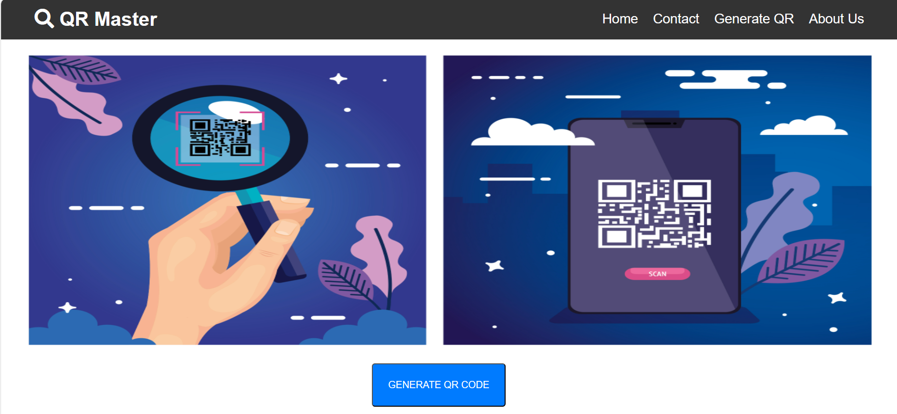

# QR Master

QR Master is a simple web application for generating QR codes. It provides an easy-to-use interface for creating QR codes for various purposes.

## Features

- Generate QR codes quickly and easily.
- Customize QR codes with different colors and styles.
- Download QR codes in high quality for print and digital use.

## Usage

1. Clone this repository to your local machine.
2. Open `index.html` in your web browser.
3. Enter the desired content for your QR code.
4. Click on the "Generate QR Code" button to create the QR code.
5. Download the generated QR code to your device.

## Technologies Used

- HTML
- CSS
- JavaScript

## Output

## deployed on
[QR Master](https://qr-master.vercel.app/)

Visitors Count  

